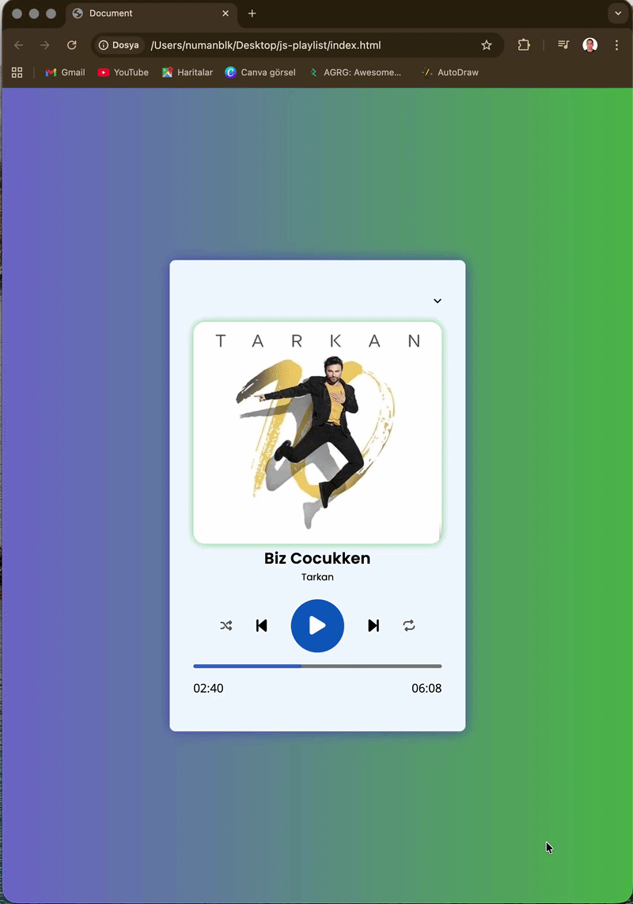
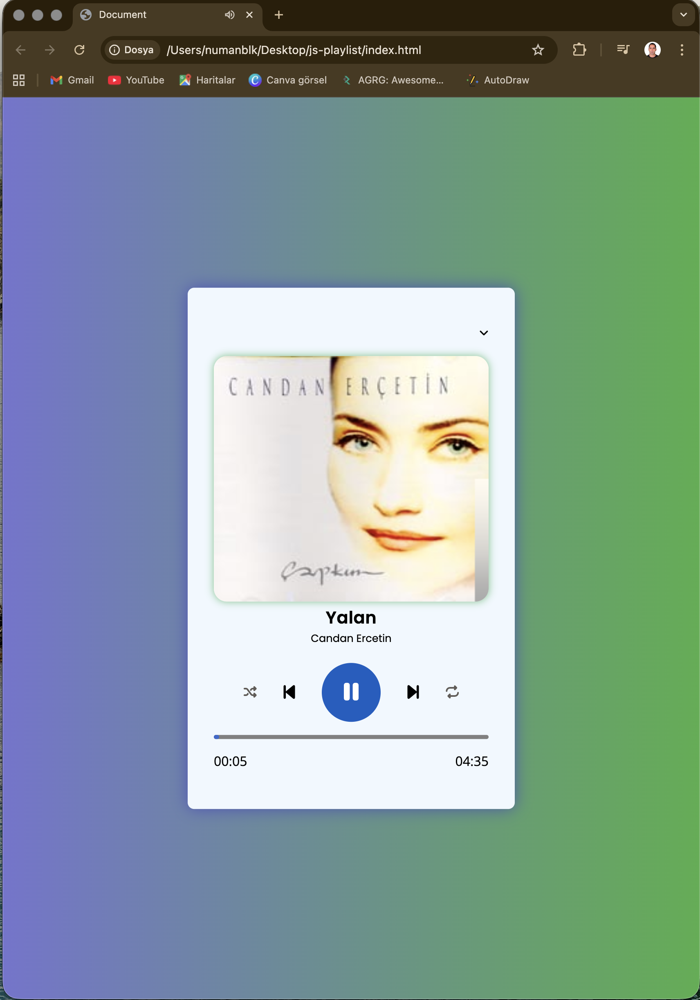
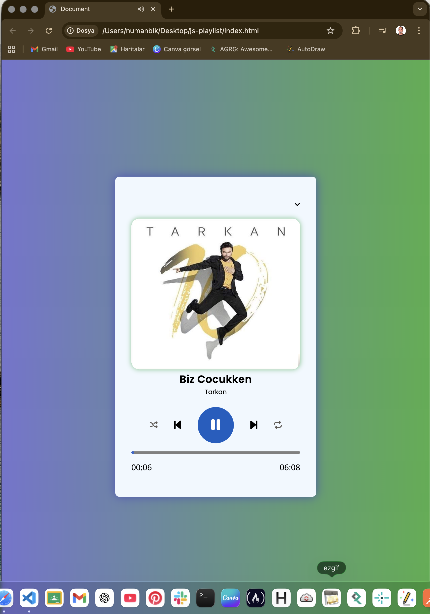
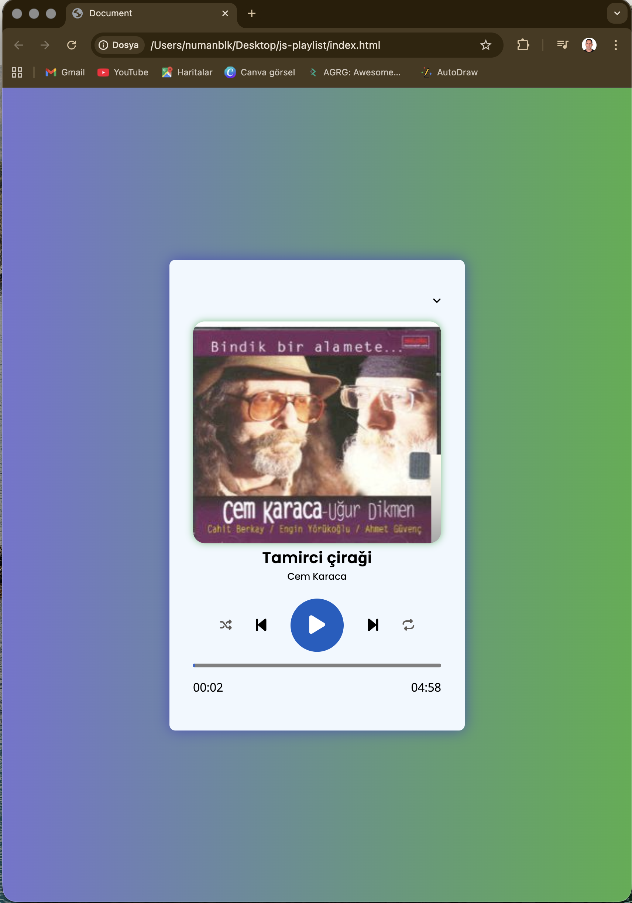
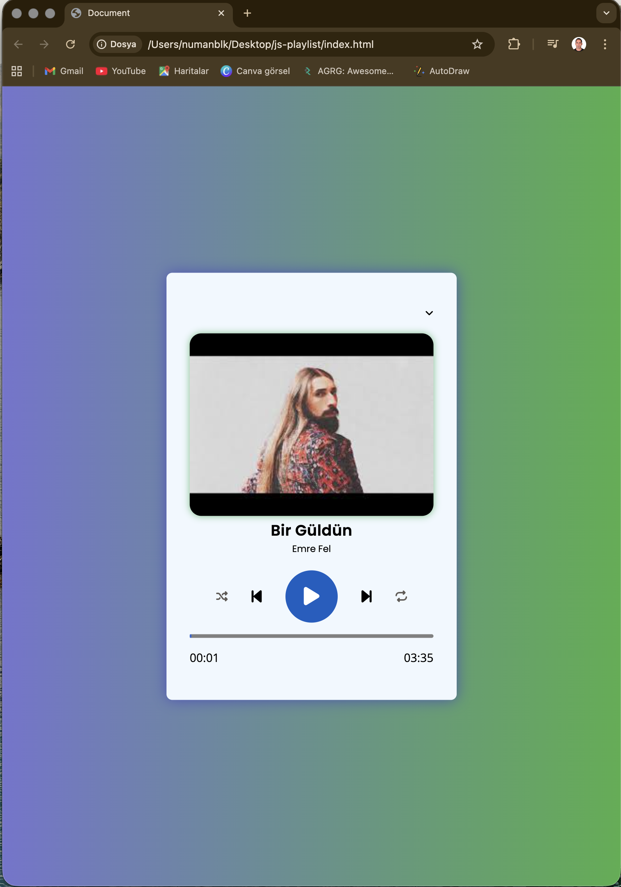
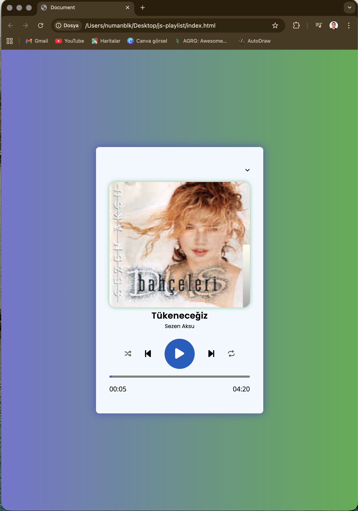

⸻

🎵 js-playlist

Modern ve responsive bir müzik playlist arayüzü.
Temiz tasarım, düzenli kod yapısı ve kullanıcı deneyimi odaklı geliştirilmiştir.

⸻

🎬 Demo Preview

Uygulamanın genel akışı ve etkileşim yapısı.

⸻

## 🎬 Demo

---

## 🖼 Interface Screens

### 🏠 Screen 1 – Ana Görünüm

---

### 🎵 Screen 2 – Playlist Detay

---

### 🎧 Screen 3 – Aktif Müzik Alanı

---

### 📋 Screen 4 – İçerik Yapısı

---

### 📱 Screen 5 – Responsive Görünüm

⸻

💻 Technologies Used

🟧 HTML
🎨 CSS
⚡ Responsive Layout
🧩 Component-style structure

⸻

🎯 Project Goals
	•	Temiz ve okunabilir kod yapısı
	•	Responsive tasarım prensipleri
	•	UI/UX odaklı arayüz tasarımı
	•	Modern layout kullanımı
	•	Git & GitHub ile versiyon kontrolü

⸻

🎓 Education & Development

Bu proje, frontend gelişim sürecimin bir parçasıdır.
Yapıyı sıfırdan kurarak tasarım ve kod organizasyonu üzerine bilinçli çalışılmıştır.

⸻

🙏 Acknowledgment

Frontend eğitim sürecimdeki disiplinli yaklaşımı ve rehberliği için
https://github.com/isveckrali’a teşekkür ederim.

Ayrıca yapılandırılmış ve kariyer odaklı eğitim modeli için https://github.com/Udemig platformuna teşekkür ederim.

⸻

